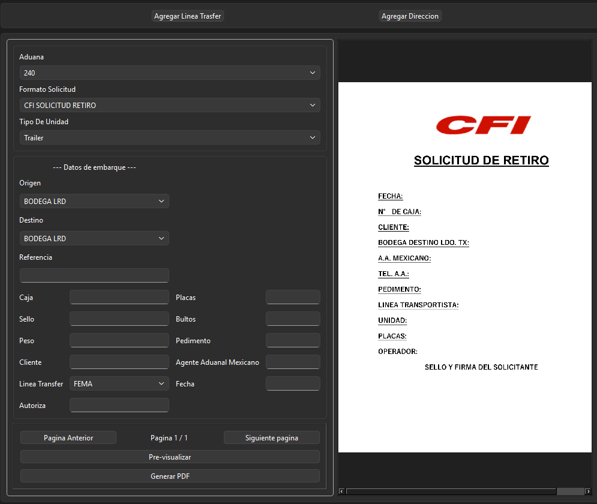

# 📦 Sistema de Gestión de Solicitudes de Retiro (Warehouse Withdrawal System)


## 📋 Descripción General
Este proyecto es una solución de software diseñada para **automatizar y estandarizar el proceso de solicitudes de retiro de mercancía** en un entorno de almacén y aduanas. 

El objetivo principal es eliminar la captura manual de datos (que es propensa a errores humanos), asegurar la integridad de la información y reducir los tiempos de espera en la ventanilla de despacho.

## 🚧 El Problema (Contexto de Negocio)
En la operación logística tradicional, las solicitudes de retiro suelen hacerse mediante correos electrónicos no estructurados o formatos en papel. Esto ocasiona:
* **Errores de captura:** Datos incorrectos en números de parte o cantidades.
* **Pérdida de trazabilidad:** Dificultad para saber quién solicitó qué y cuándo.
* **Retrasos operativos:** El Agente de trafico pierde tiempo en estar generando archivos por indivuales, asi como el cheklist delivery order + la solicitud de retiro.
* **Proceso Manual:** El Agente se demora en subir los documentos a la plataforma digital.

## 🛠 La Solución
Desarrollé una aplicación en **Python** que funciona como una interfaz de control para:
1.  **Validar datos de entrada:** Asegura que los campos críticos (Pedimento, # de Parte, Cantidad) cumplan con el formato correcto antes de procesar.
2.  **Generación Automática:** Crea los documentos de salida necesarios en formato PDF, cual seria 3 archivos y los sube a la plataforma digital.

## 📸 Demo / Capturas de Pantalla


> *Vista de la interfaz de captura donde el usuario ingresa los datos validados.*

## 🚀 Tecnologías Utilizadas
* **Lenguaje:** Python 3.x
* **Interfaz Gráfica (GUI):** PyQt5
## ⚙️ Instalación y Uso

1.  Clonar el repositorio:
    ```bash
    git clone [https://github.com/Rolly93/solicitud_retiro.git](https://github.com/Rolly93/solicitud_retiro.git)
    ```
2.  Instalar dependencias:
    ```bash
    pip install -r requirements.txt
    ```
3.  Ejecutar la aplicación:
    ```bash
    python main.py
    ```

## 📈 Impacto Esperado
Con la implementación de esta herramienta, se proyecta:
* Reducción del **90% en errores de dedo** en las solicitudes.
* Ahorro de **30 minutos** por cada solicitud procesada y subida a la plataforma digital.
* Estandarización total de las Solicitdudes de Retiro.


---
**Desarrollado por [Rolando Rios](https://www.linkedin.com/in/rolando-guadalupe-rios-lopez-14090623b/)** *Ingeniero en Sistemas enfocado en Soluciones Logísticas.*
